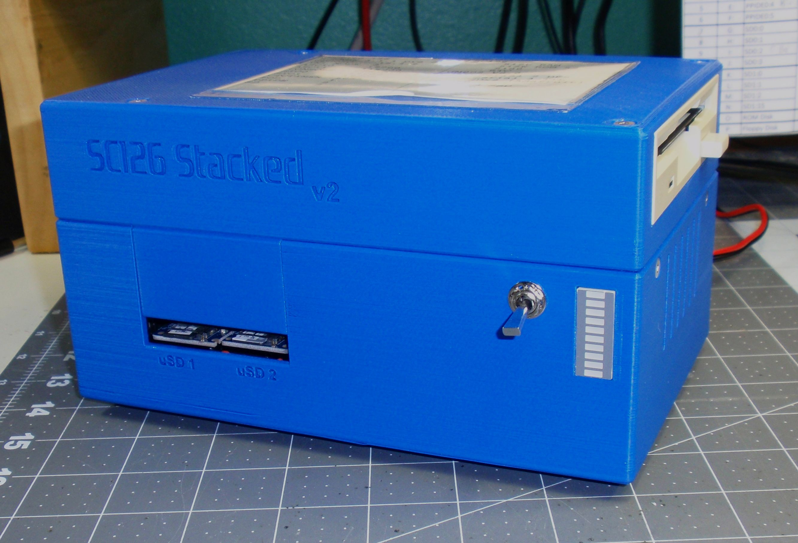
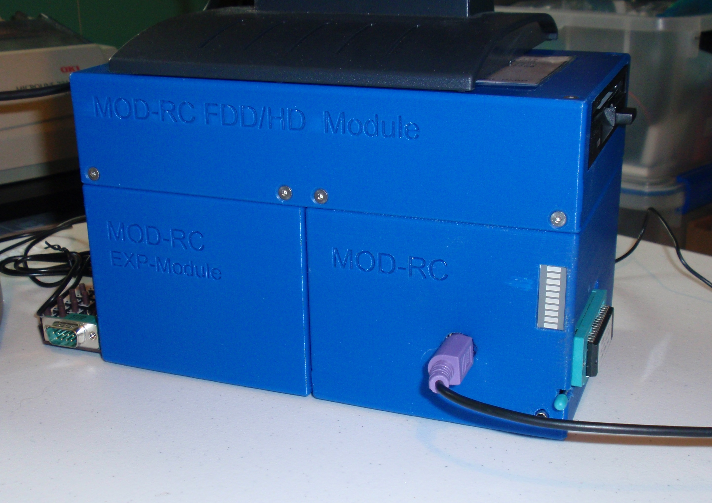

# Retro3DCases
3D Printer Files for enclosing some retro-computer boards...

## SC126 Compact v1

- [x] STL Design Files Available for Printing
- [x] Autodesk(R) Fusion360 Project Files Available
- [x] Case Assembly and Preparation Instructions Guide Available
- [x] BOM Included in Guide
- [ ] Detailed Printing Instructions Available

## SC126 Stacker v2

## RC2014 Modular v2 (Prototype)

